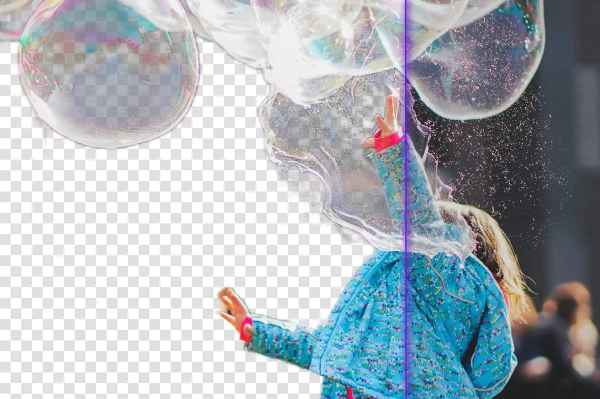

# withoutbg



**Remove backgrounds in Python. Free locally. One line to switch to the Cloud API.**

[](https://pypi.org/project/withoutbg/)
[](https://opensource.org/licenses/Apache-2.0)
[](https://github.com/withoutbg/withoutbg/actions/workflows/ci.yml)

Same API for both paths: run open weights on your machine (private, offline, unlimited) or call the Cloud API (sharper edges on hair and fur, no local GPU). Built for scripts, notebooks, backends, and batch jobs.

**[Full documentation →](https://withoutbg.com/docs/open-model/python?utm_source=github&utm_medium=withoutbg-readme&utm_campaign=main-readme)**

## See the results


**[Open Weights results →](https://withoutbg.com/open-model/results?utm_source=github&utm_medium=withoutbg-readme&utm_campaign=main-readme)** · **[Cloud API results →](https://withoutbg.com/pro-model/results?utm_source=github&utm_medium=withoutbg-readme&utm_campaign=main-readme)** · **[Compare →](https://withoutbg.com/compare/withoutbg-open-model-vs-pro-model?utm_source=github&utm_medium=withoutbg-readme&utm_campaign=main-readme)**

## Three lines of Python

```python
from withoutbg import WithoutBG

model = WithoutBG.open_weights()
model.remove_background("photo.jpg").save("result.png")
```

Returns a PIL `Image` in RGBA. Prefer PNG or WebP; JPEG drops transparency silently.

## Install

```bash
uv add withoutbg
```

Don't have [uv](https://astral.sh/uv) yet? It's a fast Python package manager from Astral. Install it once, then the command above.

## Quick start

**Local (Open Weights: free, private, offline):**

```python
from withoutbg import WithoutBG

model = WithoutBG.open_weights()
result = model.remove_background("input.jpg")
result.save("output.png")
```

First local run downloads ~455 MB of weights from Hugging Face (once). After that, everything stays on your machine.

**Cloud (withoutBG API: best quality):**

```python
from withoutbg import WithoutBG

# Pass api_key here, or set WITHOUTBG_API_KEY in the environment
model = WithoutBG.api(api_key="sk_your_key")
result = model.remove_background("input.jpg")
result.save("output.png")
```

**Batch (load once, process many):**

```python
from withoutbg import WithoutBG

model = WithoutBG.open_weights()  # keep this object alive

images = ["photo1.jpg", "photo2.jpg", "photo3.jpg"]
results = model.remove_background_batch(images, output_dir="results/")
```

Recreating the model for every image reloads the weights each time. Don't do that in a loop.

**Progress callback:**

```python
def on_progress(value: float) -> None:
    print(f"{value * 100:.0f}%")

result = model.remove_background("photo.jpg", progress_callback=on_progress)
```

Runnable scripts live in [`examples/`](examples/).

## Choose your mode

| | Local (`open_weights()`) | Cloud (`api()`) |
|---|---|---|
| Cost | Free forever | Pay per image |
| Quality | Good | Better (esp. hair, fur) |
| Privacy | Stays on your machine | Image sent to API |
| GPU required | No (CPU ONNX) | No |
| First-run setup | ~455 MB download, once | API key only |
| Best for | Offline, private, batch jobs | Products, occasional use |

```
Need offline or private processing?   → Local
Processing a large batch?             → Local (pay setup once, amortize across images)
Building a product?                   → Cloud (better quality, zero infra)
Occasional use, no setup tolerance?   → Cloud
```

## CLI

```bash
# Single image (local model)
withoutbg photo.jpg
withoutbg photo.jpg --output result.png

# Cloud API
export WITHOUTBG_API_KEY=sk_your_key
withoutbg photo.jpg --use-api

# JPEG with white background fill
withoutbg portrait.jpg --format jpg --quality 95

withoutbg --help
```

## What you get

All methods return a PIL `Image` in RGBA mode:

```python
result = model.remove_background("photo.jpg")

result.save("output.png")   # keeps transparency
result.save("output.webp")  # keeps transparency
result.save("output.jpg")   # transparency dropped silently
```

Compositing example:

```python
from PIL import Image
from withoutbg import WithoutBG

model = WithoutBG.open_weights()
fg = model.remove_background("subject.jpg")
bg = Image.open("background.jpg")
bg.paste(fg, (0, 0), fg)  # alpha used as mask
bg.save("composite.png")
```

## Configuration

| Environment variable | Effect |
|---|---|
| `WITHOUTBG_API_KEY` | API key for Cloud mode (alternative to `api_key=`) |
| `WITHOUTBG_MODEL_PATH` | Path to a local `.onnx` file (skips Hugging Face download) |

When using `WITHOUTBG_MODEL_PATH`, keep the sidecar metadata file (`withoutbg-open-weights.onnx.json`) next to the ONNX file.

## Error handling

```python
from withoutbg import WithoutBG, APIError, WithoutBGError

try:
    model = WithoutBG.api()
    result = model.remove_background("photo.jpg")
    result.save("output.png")
except APIError as e:
    print(f"API error: {e}")
except WithoutBGError as e:
    print(f"Processing error: {e}")
```

## Troubleshooting

**Model download fails:** Weights come from [Hugging Face](https://huggingface.co/withoutbg/withoutbg-openweights-onnx) on first local run (~455 MB). Check your connection, or set `WITHOUTBG_MODEL_PATH` to a local copy.

**Import error:**

```bash
which python
uv pip list | grep withoutbg
uv add withoutbg
```

**API key rejected:** Get a key at [withoutbg.com](https://withoutbg.com). Set `export WITHOUTBG_API_KEY=sk_your_key`.

**Migrating from older names** (`WithoutBG.opensource()`, `ProAPI`): see [docs/MIGRATION.md](docs/MIGRATION.md).

## More than Python

This package is the **in-process** path: embed withoutBG in your Python code or CLI. Same open-weights technology powers the rest of the ecosystem; pick the surface that matches your workflow:

| Surface | Choose when |
|---|---|
| **[Docker / self-host](https://github.com/withoutbg/withoutbg-inference)** | You want an HTTP API or browser UI on your own server (CPU or NVIDIA GPU) |
| **[Mac app](https://withoutbg.com/mac)** | You want a native desktop cutout tool, with an optional Local API for plugins and scripts |
| **[GIMP plugin](https://github.com/withoutbg/withoutbg-gimp)** | You edit in GIMP 3 and want a private, mask-first workflow via Mac Local API or Docker |
| **[Hugging Face](https://huggingface.co/withoutbg/withoutbg-openweights-onnx)** · **[Space](https://huggingface.co/spaces/withoutbg/withoutbg)** | You want to try a demo or download the ONNX weights directly |
| **[Cloud API](https://withoutbg.com/pro-model)** | You need maximum quality without running inference yourself |

```bash
# Self-host the open-weights web app (CPU)
docker run --rm -p 8080:8080 withoutbg/withoutbg-openweights-v3-app-cpu
```

## Model

The withoutBG Open Weights Model is a unified ONNX graph hosted at [withoutbg/withoutbg-openweights-onnx](https://huggingface.co/withoutbg/withoutbg-openweights-onnx). Depth, segmentation, matting, and refinement run in one pass. Built with DINOv3.

Licensed under the [withoutBG Open Model License](https://withoutbg.com/open-model/license) (Apache 2.0 for withoutBG portions; Meta DINOv3 License for DINOv3 backbone weights).

## Development

```bash
uv sync --extra dev

make test-fast    # fast unit tests
make quality      # lint + format + type check
make test         # full suite (downloads model on first run)
```

See [CONTRIBUTING.md](CONTRIBUTING.md) for the full guide.

## License

This Python SDK is licensed under Apache License 2.0. See [LICENSE](LICENSE).

The withoutBG Open Weights Model is a composite artifact with additional terms
for embedded DINOv3 weights. See the
[withoutBG Open Model License](https://withoutbg.com/open-model/license),
[LICENSE-DINOv3](LICENSE-DINOv3), and [NOTICE](NOTICE).

### Third-party components

- **DINOv3 (Meta)**: Meta DINOv3 License (backbone weights in the Open Weights Model)
- **Depth Anything V2**: Apache 2.0 (small variant; only the small variant is permissive)

See [THIRD_PARTY_LICENSES.md](THIRD_PARTY_LICENSES.md) for complete attribution.

## Support

- **Bugs / questions:** [GitHub Issues](https://github.com/withoutbg/withoutbg/issues)
- **Commercial:** [contact@withoutbg.com](mailto:contact@withoutbg.com)
- **Security:** [contact@withoutbg.com](mailto:contact@withoutbg.com) (see [SECURITY.md](SECURITY.md))
